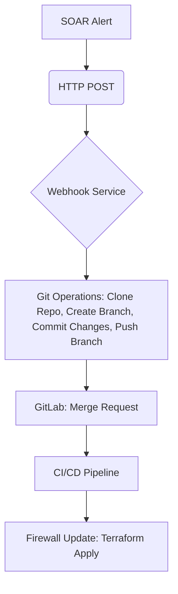

# SOAR Webhook Service: Product Development Requirements (PDR)

## 1. Project Purpose & Goals

The SOAR Webhook Service automates firewall blocklist updates. It aims to integrate Security Orchestration, Automation, and Response (SOAR) platforms with the Firewall GitOps workflow, enabling rapid response to security alerts by automatically updating firewall configurations.

**Goals:**
- **Automate Threat Response:** Instantly block malicious IPs identified by SOAR platforms.
- **Maintain GitOps Integrity:** All firewall changes are managed through Git, ensuring version control, auditability, and rollback capabilities.
- **Vendor Agnostic (Future):** Initial focus on PAN-OS, with architecture supporting future expansion to other firewall vendors.

## 2. Integration Flow

The service acts as a bridge between SOAR alerts and the GitOps-driven firewall management.

1.  **SOAR Alert**: A security event triggers an alert in a SOAR platform.
2.  **HTTP POST**: The SOAR platform sends an HTTP POST request (webhook) to the Webhook Service.
3.  **Webhook Service**:
    *   Receives and validates the alert payload.
    *   Clones the firewall configuration repository.
    *   Creates a new Git branch.
    *   Updates the specified YAML file (e.g., `clusters/production/objects.yaml`) to add the malicious IP to a blocklist.
    *   Commits and pushes the changes to GitLab.
    *   Creates a Merge Request (MR) in GitLab.
4.  **GitLab CI/CD Pipeline**: The MR triggers the CI/CD pipeline.
5.  **Firewall Update**: Terraform applies the changes, updating the firewall blocklist.

## 3. Key Features & Requirements

### Functional Requirements

-   **Webhook Reception**: Receive HTTP POST requests from SOAR platforms.
-   **Payload Processing**: Extract IP addresses or other relevant data from the webhook payload.
-   **Git Repository Management**:
    *   Clone a GitLab repository.
    *   Create new branches.
    *   Commit changes to YAML files.
    *   Push branches to GitLab.
    *   Create Merge Requests for review and deployment.
-   **YAML Configuration Update**:
    *   Locate and update specific YAML files (e.g., `clusters/<cluster>/objects.yaml`).
    *   Add new IP addresses to a designated blocklist within the YAML structure, preserving existing content, comments, and indentation.
-   **Configuration via Environment Variables**: All operational parameters (GitLab credentials, target cluster, YAML paths, server port) must be configurable via environment variables.

### Non-Functional Requirements

-   **Availability**: High availability (e.g., via multiple replicas in Kubernetes).
-   **Scalability**: Able to handle a high volume of concurrent webhook requests.
-   **Security**: Secure handling of GitLab tokens and other sensitive information. Input validation for Git commands.
-   **Observability**: Logging and health check endpoints.
-   **Maintainability**: Clean, modular Go codebase with good test coverage.
-   **Performance**: Low latency for processing alerts and initiating Git operations.

## 4. Security Requirements

-   **Environment Variables for Secrets**: All sensitive information (GitLab tokens, API keys) must be passed via environment variables and never hardcoded or committed to the repository.
-   **GitLab CI/CD Secrets**: Secrets used by the CI/CD pipeline must be stored in GitLab CI/CD variables.
-   **Webhook Authentication/Authorization**: Future phase to include `WEBHOOK_SECRET` for signature validation of incoming webhooks to ensure authenticity.
-   **Least Privilege**: The GitLab token used by the service should have the minimum necessary permissions (e.g., repository read/write, merge request creation).
-   **Input Validation**: Strict validation of all inputs, especially those used in Git commands, to prevent command injection or other security vulnerabilities.
-   **Container Security**: Run as a non-root user in containers with dropped capabilities.
-   **Resource Cleanup**: Ensure temporary directories and cloned repositories are securely cleaned up after use to prevent sensitive data exposure.
